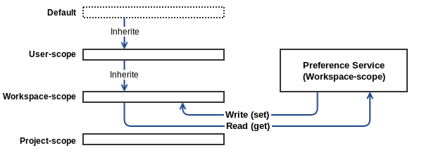

# Preference Plugin

## Overview

This plugin makes creating, editing, removing on preference values and notifying its changes possible.
You can access and listen these values using scope-based `PreferenceService` returned by `PreferenceServiceFactory.get()` method.

### Basic Concept


#### PreferenceManager

- Read and write configuration file `preferences.json`.
- load all extensions
- Listen on file change event related with configuration files.
- Create and manage list of the preference store

#### ViewController

- To open or close preference dialog
- Handle actions of buttons on the dialog by current store's status
- Request a `Page` and append it on the dialog by selected preference item

#### Scopes

`Scope` means the applicable range of preference values.
For example, `WORKSPACE` scoped preference is only accessible by 'WORKSPACE'-scoped PreferenceService.
But if `PROJECT` scoped preference for same preference ID doesn't override parent(WORKSPACE) scope values,
'WORKSPACE' scoped preference values is also accessible by 'PROJECT'-scoped PreferenceService.

##### User Scope

- configurations per user
- this preference file is located at `wfs://.userinfo/preferences.json`
- In the next step, this preference's file will be separated into the files that have specific settings for each apps(ide, dashboard, etc.).

##### Workspace Scope

- configurations per workspace
- `wfs://{workspaceName}/.workspace/preferences.json

##### Project Scope

- configurations per project
- `wfs://{workspaceName}/{projectName}/.project/preferences.json`
- In the next step, project scope will be able to be specified with `projectNature` also.

## Structure

```
webida.preference
 ├── layout
 │ ├── preference.html                      - main layout
 │ └── preference-tree.html                 - tree layout
 ├── pages                                  - PreferencePage implementations
 ├── services                               - PreferenceService implementations
 ├── style
 │ ├── image
 │ ├── simple-page-style.css                - style declaration for SimplePage
 │ └── style.css
 ├── plugin.js
 ├── plugin.json
 ├── preference-manager.js                  - Preference file manager
 ├── preference-store.js                    - Preference model for each Preference Page
 ├── README.md
 ├── tree-view-controller.js                - managing on tree layout, css and UI events
 └── view-controller.js                     - managing on layout, css and UI events
```

## Extensions

### webida.preference:pages

- id(string): preference ID
- hierarchy(string): preference category
    - If it is empty string, this preference will be shown as root item.
    - e.g. "ancestor-preference-id/parent-preference-id"
- name(string): Preference name used by UI label
- page(string): PreferencePage Class
    - e.g. "SimplePage": Using default "SimplePage" class
    - e.g. "to/class/module/path/CustomPage": Using custom "CustomPage" class
- pageData(function): name of the method to get additional data for PreferencePage instance
- getDefault(function): name of the method to get default values
- scope(Array|string): valid ranges of scope(`USER`, `WORKSPACE`, `PROJECT`)
    - e.g. `["USER", "WORKSPACE"]`: This preference is only accessible in `USER` or `WORKSPACE` scope
    - e.g. `"PROJECT"`: The preference is only accessible in `PROJECT` scope


## Usage

### Extension

If you need to add new preference page, follow below instructions.

1. add `webida.preference:pages` extension description on your `plugin.json`

```
    ...
    "webida.preference:pages" : [
        {
            "module": "plugins/webida.editor.text-editor/preferences/preference-appearance",
            "id": "texteditor",
            "hierarchy": "",
            "name": "Editor",
            "page": "SimplePage",
            "pageData": "getSchema",
            "getDefault": "getDefault",
            "scope": ["WORKSPACE"],
            "hidden": false
        },
        ...
    ]

```

The `hidden` field is optional. 
For determining whether showing the preference item or not in preferences dialog, the `hidden` field will be used.

This preference item  will be shown at the top of the tree. And its display name will be `Editor`.
And It is scoped only `WORKSPACE`.


2. The `SimplePage` is the automated form-generating Page provided by default.
If you choose `SimplePage` you should provide pageData through a method named `getSchema` in the module `plugins/webida.editor.text-editor/preferences/preference-appearance`.

```
...
getSchema: function () {
    return [
        {
            type: 'group',
            title: 'Theme'
        },
        {
            key: 'webida.editor.text-editor:cm-theme',
            type: 'select',
            opt: {
                name: 'Editor theme',
                items: TextEditorViewer.getAvailableThemes()
            }
        },
        {
            type: 'group',
            title: 'Font'
        },
        {
            key: 'webida.editor.text-editor:fontSize',
            type: 'slider',
            opt: {
                name: 'Editor font size',
                min: 7,
                max: 21,
                step: 1,
                labels: ['7', '9', '11', '13', '15', '17', '19', '21']
            }
        },
        {
            key: 'webida.editor.text-editor:font',
            type: 'select',
            opt: {
                name: 'Editor font',
                items: [
                    { label: 'Nanum Gothic Coding', value: 'Nanum Gothic Coding'},
                    { label: 'Arial', value: 'Arial, Helvetica, sans-serif'},
                    { label: 'Arial Black', value: 'Arial Black, Gadget, sans-serif'},
                    { label: 'Comic Sans MS', value: 'Comic Sans MS, cursive'},
                    { label: 'Courier New', value: 'Courier New, monospace'},
                    { label: 'Georgia', value: 'Georgia, serif'},
                    { label: 'Impact', value: 'Impact, Charcoal, sans-serif'},
                    { label: 'Lucida Console (Monaco)', value: 'Lucida Console, Monaco, monospace'},
                    { label: 'Lucida Sans Unicode (Lucida Grande)',
                        value: 'Lucida Sans Unicode, Lucida Grande, sans-serif'},
                    { label: 'Palatino Linotype (Book Antiqua)',
                        value: 'Palatino Linotype, Book Antiqua, Palatino, serif'},
                    { label: 'Tahoma (Geneva)', value: 'Tahoma, Geneva, sans-serif'},
                    { label: 'Times New Roman', value: 'Times New Roman, Times, serif'},
                    { label: 'Trebuchet MS', value: 'Trebuchet MS, sans-serif'},
                    { label: 'Verdana', value: 'Verdana, Geneva, sans-serif'},
                    { label: 'MS Serif (New York)', value: 'MS Serif, New York, serif'},
                    { label: 'Consolas', value: 'Consolas'}
                ]
            }
        },
        {
            type: 'group',
            title: 'Editor Config'
        },
        {
            key: 'webida.editor.text-editor:editorconfig',
            type: 'checkbox',
            opt: {
                name: 'Use .editorconfig files'
            }
        }
    ];
},
...

```

3. And you also have to provide default values for your preference item.

```
...
getDefault: function () {
    return {
        'webida.editor.text-editor:cm-theme': 'webida-dark',
        'webida.editor.text-editor:fontSize': 13,
        'webida.editor.text-editor:font': 'Nanum Gothic Coding',
        'webida.editor.text-editor:editorconfig': false
    };
},
...
```

4. And you can see this item on the preference dialog.

### Preference Service

For getting or setting and listening to changing on preference values, you can use preference service by `PreferenceServiceFactory` like below.



```
define([
    'plugins/webida.preference/preference-service-factory'
], function(
    PreferenceServiceFactory
) {
    var preferenceService = PreferenceServiceFactory.get('WORKSPACE');
    ...
    preferenceService.addFieldChangeListener('workspace.preference', function (values) {...});
    preferenceService.getValues('workspace.preference', function (values) {...});
    preferenceService.getValue('workspace.preference', 'workspace:filter:.*', function (value) {...});
    ...

    var projectScopedPreferenceService = PreferenceServiceFactory.get('PROJECT', 'projectName');
    ...
    projectScopedPreferenceService.getValues('workspace.preference', function (values) {...});
    ...
});
```

#### PreferenceService API

- getValue(preferenceId, fieldKey, callback)
- getValues(preferenceId, callback)
- setValue(preferenceId, fieldKey, fieldValue, callback)
- setValues(preferenceId, values, callback)
- addFieldChangeListener(preferenceId, listener)
- removeFieldChangeListener(preferenceId, listener)